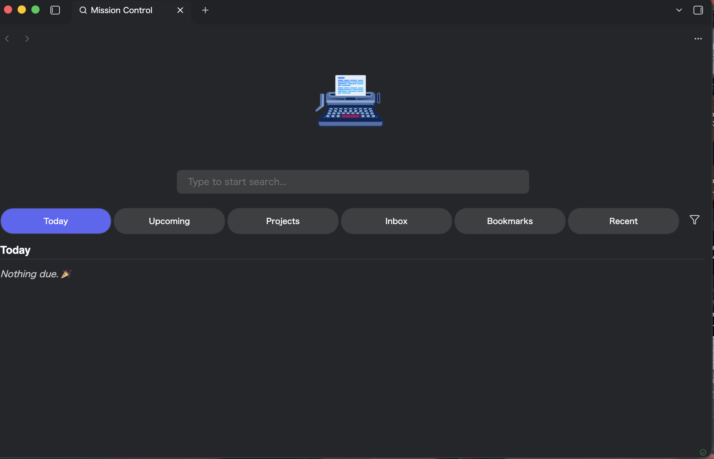

# Mission Control

Mission Control turns a configurable vault folder into a home-tab dashboard for tasks, projects, recurring work, bookmarks, recent files, and inbox notes.



## Features

- Today and upcoming task views with due, scheduled, overdue, priority, and in-progress states
- Project summaries grouped by source note and heading
- Recurring-task overview and automatic creation of the next occurrence when a task is completed
- Tag filtering across indexed notes
- Inbox, Bookmarks, and recent-file tabs
- Full-text search through the optional [Omnisearch](https://github.com/scambier/obsidian-omnisearch) plugin, with a built-in filename fallback
- Configurable startup behavior, dashboard tabs, title, logo, fonts, and colors
- Desktop and mobile layouts

Mission Control reads task syntax used by [Tasks](https://publish.obsidian.md/tasks) and Dataview, but neither plugin is required.

## Getting started

1. Open **Settings → Mission Control**.
2. Choose a **Task source folder**. Mission Control scans Markdown files in this folder recursively.
3. Optionally choose an **Inbox folder**, enable or hide dashboard tabs, and configure the day boundary.
4. Run **Mission Control: Open new tab** or use the ribbon icon.

Mission Control recognizes Markdown task lines such as:

```markdown
- [ ] Write release notes 📅 2026-08-12 ⏫ #release
- [ ] Weekly review 🔁 every week ⏳ 2026-08-14
- [/] Investigate mobile layout [priority:: high]
```

Supported task states are open (`[ ]`), complete (`[x]`), in progress (`[/]`), and cancelled (`[-]`). Supported date fields include due (`📅`), scheduled (`⏳`), start (`🛫`), completion (`✅`), and created (`➕`).

## Optional integrations

- **Omnisearch:** enables full-text results in the search bar. Without it, Mission Control searches filenames and aliases.
- **Bookmarks:** enables the Bookmarks dashboard tab when Obsidian's core Bookmarks plugin is active.

## Manual installation

Download `main.js`, `manifest.json`, and `styles.css` from a release and place them in:

```text
<vault>/.obsidian/plugins/mission-control/
```

Restart Obsidian, then enable **Mission Control** under **Community plugins**.

## Development

Requires Node.js 18 or newer.

```bash
npm ci
npm run dev
npm test
npm run build
```

Set `VAULT_PLUGIN_DIR` and run `npm run deploy` to copy a production build into a development vault.

## Credits

The home-tab shell was adapted from [obsidian-home-tab](https://github.com/olrenso/obsidian-home-tab) by Lorenzo (olrenso), under the MIT License. Its original license is preserved in [`licenses/obsidian-home-tab-LICENSE`](licenses/obsidian-home-tab-LICENSE).

Mission Control is released under the [MIT License](LICENSE).
